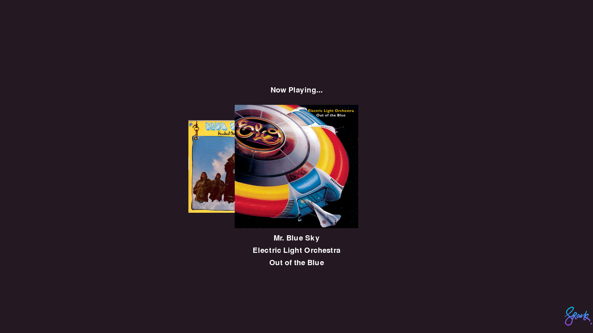
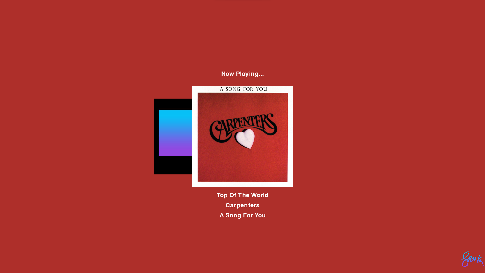
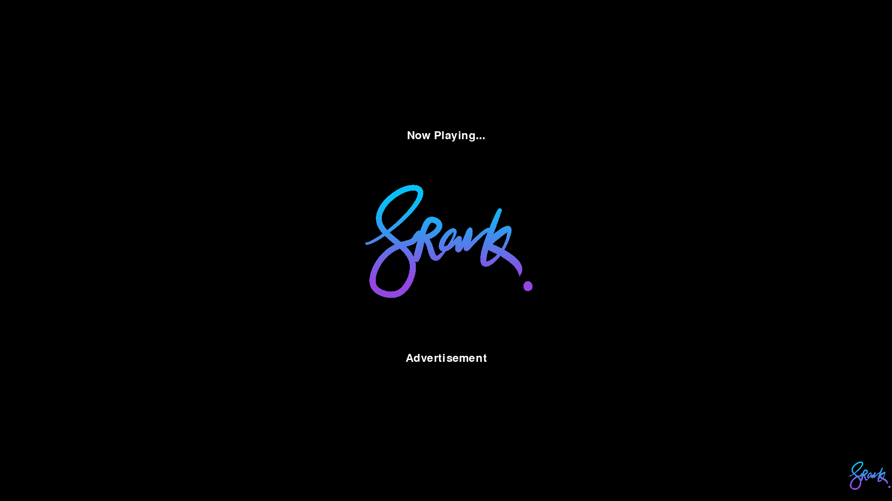

# SpotiSync a Spotify Visualizer
 A lightweight Spotify player/visualizer built in Python - recommended for low power computers such as Raspberry Pi  to show your Now Playing song and the last listened song!

## Introduction

Spotify Visualizer is a Python program that creates a dynamic visual display of the currently playing song on Spotify. It utilizes the Spotify API and various libraries to fetch album art, extract dominant colors, and display song information in a visually appealing manner.


 Background color changes depending on the album art.

 Text color changes for best contrast and readability.

 Advertisment Detection for non-Premium users.


## Features

- Real-time visualization of currently playing songs on Spotify.
- Automatic detection of new songs and advertisement content.
- Display of song title, artist name, album name, and album art.
- Display album art of last listened song.
- Background color adaptation based on the dominant color of the album art.
- All text changes to either Black or White dependent on the dominant color for the best contrast.

## Requirements

- Python 3.x
- Python libraries: `requests`, `spotipy`, `PIL`, `io`, `pygame`, `fast_colorthief`
- Spotify developer account with client ID and client secret.
- A machine with a screen to display the visualization.

## Installation

1. **Clone this repository** to your local machine:
	```bash
 	git clone https://github.com/your-username/spotify-visualizer.git
2. Install the required Python libraries:
	```bash
 	pip install requests spotipy Pillow pygame colorthief
### Set up your Spotify Developer Account and obtain the client ID and client secret.
To allow authorisation to your track data, you'll need to generate Spotify API keys. You can do this by logging in to the [Spotify Dashboard](https://developer.spotify.com/dashboard/applications) creating an app.

Call the application 'SpotiSync'.

Set the _Redirect URI_ as the URL in the script (default is http://localhost:1234). This must be set else Spotify won't authorise SpotiSync.

**Important:** The _Redirect URI_ entered in this field must match the URL of the script exactly, or you'll receive authorisation errors. A common issue is that Spotify will automatically add a trailing slash to the URL upon saving. For example: `http://localhost:1234` vs `http://localhost:1234/`.

You can leave the other settings (Callback URL, Bundle IDs etc) blank.

Copy down the Client Secret and Client ID and save your app in the Spotify Dashboard.

3. Update the following variables in the script with your Spotify API credentials:
```python
SPOTIPY_CLIENT_ID = 'your-client-id'
SPOTIPY_CLIENT_SECRET = 'your-client-secret'
```
## Usage
1. Run the program using Python:
```python
python main.py
```
2. The program will display the current song playing on your Spotify account in real-time.

3. You can press the Spacebar key to exit the program.

## Credits
Developed by Frankie Pang.

## License
This project is open-source and available under the MIT License. You are free to use, modify, and distribute it.

## Happy listening and visualizing!
